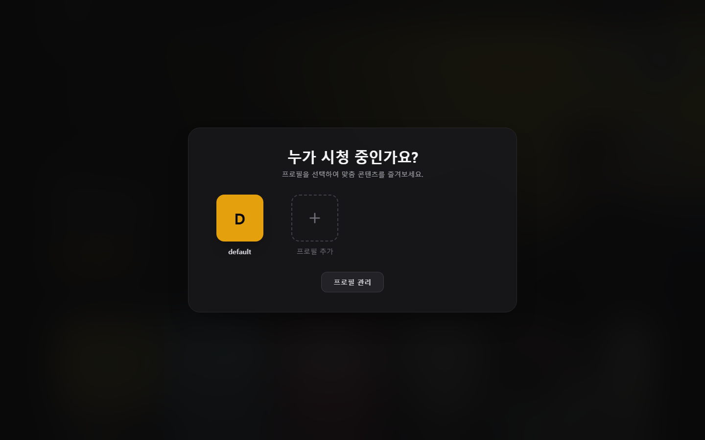
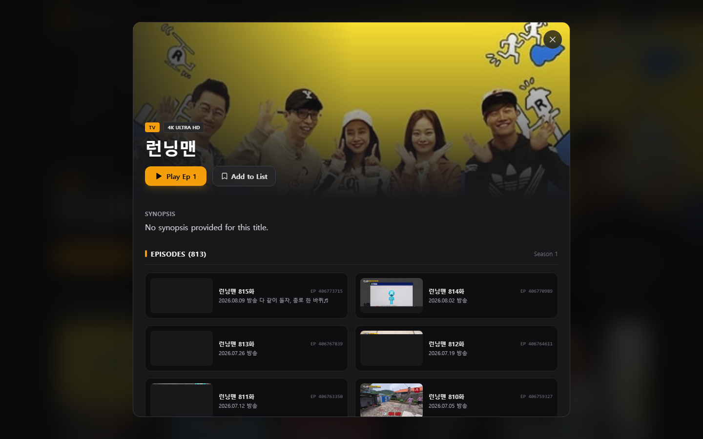
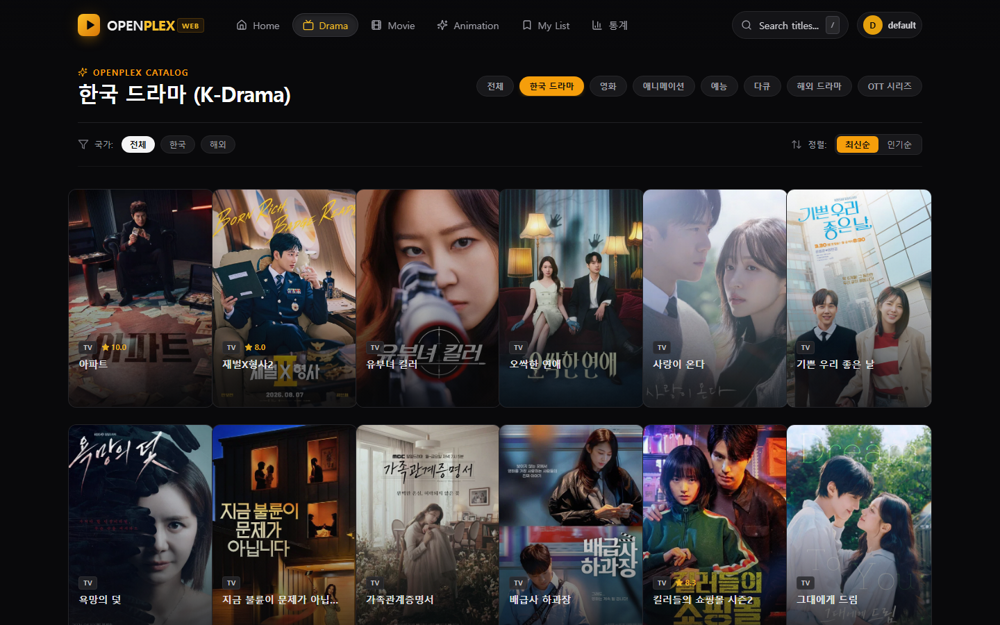
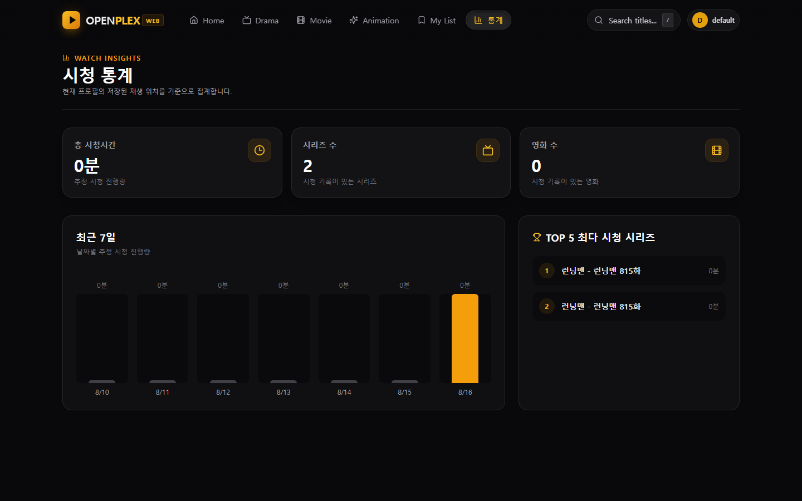

<h1 align="center">OpenPlex</h1>

<p align="center">
  <strong>내 미디어를, 내 서버에서.</strong><br/>
  프로필 · 이어보기 · 보관함 · HLS 재생까지. Plex가 하는 핵심을 로컬 파일과 공식 메타데이터만으로.
</p>

<p align="center">
  <a href="#설치"></a>
  <a href="#라이선스"></a>
  <a href="README.en.md"></a>
</p>

<p align="center">
  
</p>

---

## 한 줄로

폴더를 지정하고 스캔하면 작품 카드 · 이어보기 · 프로필 · 한글 메타데이터가 생깁니다.  
재생 소스는 **당신이 가진 파일**입니다. 외부 사이트 스크레이핑은 이 저장소에 없습니다.

## 화면

<p align="center">
  
  
</p>

<p align="center">
  
  
</p>

## Plex가 하는 것 중, 여기 있는 것

코드와 API에서 확인한 기능만 적습니다. 없는 것은 아래 “아직 없는 것”에 있습니다.

| Plex에서 익숙한 것 | OpenPlex |
|---|---|
| 홈 / 카테고리 브라우즈 | 홈 히어로, 드라마·영화·애니·만화 탭, 검색(`/`) |
| 라이브러리 스캔 | 폴더 지정 후 스캔. 영화 / 시리즈 / 만화(zip·cbz) |
| 작품 카드 · 상세 | 포스터, 한글 종류 라벨, 에피소드 목록, 이어보기 |
| 여러 사람 프로필 | 부팅 시 프로필 선택, 전환, 게스트/방문자 모드 |
| 이어보기 · 시청 기록 | 진행률 저장, Next Up, 내 목록(북마크) |
| 시청 통계 | 총 시간, 시리즈/영화 수, 최근 7일, TOP 작품 |
| 스트리밍 | HLS 세션, 로컬 VOD, 자막(SRT→VTT), 자막 스타일 |
| 트랜스코드 | 유닛별 트랜스코드 작업과 HLS 출력 |
| 외부 앱 | Jellyfin/Emby 호환 엔드포인트 (`/jellyfin`, `/emby`) |
| 메타데이터 | TMDB 한국어 → KMDb → (설정한) 메타 전용 소스. 줄거리·포스터·장르 |
| 원격 도우미 | 에이전트: 폴더 지정 → 스캔 → 메타 보강 |
| 공개 라이브러리 | 방문자 모드: 보관함만, 검색·다운로드·에이전트 숨김 |
| 확장 | `plugins/`에 소스 어댑터. 공개 저장소에는 포함되지 않음 |

### 아직 없는 것

라이브 TV · DVR, 모바일/TV 네이티브 앱, 친구 공유 계정, 하드웨어 트랜스코드 클러스터, 공식 Plex 계정 연동.  
원하면 다음 이슈로 쪼개면 됩니다.

## 설치

```bash
git clone https://github.com/MovieHolic-Plex/openplex.git
cd openplex
cp .env.example .env
npm install
npm run build
npm start
```

브라우저에서 `http://127.0.0.1:33888`.

개발 모드:

```bash
npm run dev:server   # Fastify
npm run dev:client   # Vite
```

### 사전 준비

- **Node.js 20+**
- `better-sqlite3`는 네이티브 모듈입니다. 대부분의 환경은 prebuilt를 받습니다. 소스 빌드가 필요하면 Python과 컴파일 도구가 필요합니다.
- 이 저장소의 `npm install`은 DRM/우회 네이티브를 빌드하지 **않습니다**.

## 환경변수

복사본은 [`.env.example`](.env.example)에 있습니다. 자주 쓰는 것만:

| 변수 | 기본 | 설명 |
|---|---|---|
| `OPENPLEX_BIND` | `127.0.0.1` | 루프백 기본. LAN 바인드는 `OPENPLEX_AUTH_TOKEN` 필수 |
| `PORT` | `33888` | 미디어 서버 포트 |
| `OPENPLEX_DATA_PATH` | `.data` | SQLite와 설정 |
| `OPENPLEX_MEDIA_PATH` | `.data/media` | 로컬 미디어 루트 |
| `KMDB_API_KEY` | — | 있으면 KMDb를 체인에 넣음 |
| `DEEPSEEK_API_KEY` | — | 에이전트 |

진짜 키를 커밋하지 마세요.

## 구조

```
client/     React + Vite UI
server/     Fastify API, 스캔, HLS 게이트웨이, 에이전트
shared/     공통 타입
plugins/    로컬 전용 확장 (gitignore)
```

새 소스를 붙이려면 [`docs/adapters.md`](docs/adapters.md)를 보세요.

## 테스트

```bash
npm test                          # 서버 vitest
npx playwright test               # UI (먼저 cd client && npm run build)
npm run typecheck && npm run lint
```

## 주의

이 프로젝트는 **본인이 소유한 미디어**를 정리하고 재생하기 위한 것입니다.  
붙이는 소스의 합법성은 사용자 책임입니다. 저작권 우회·DRM 해제 코드는 이 저장소에 없습니다.

## 라이선스

[MIT](LICENSE)
